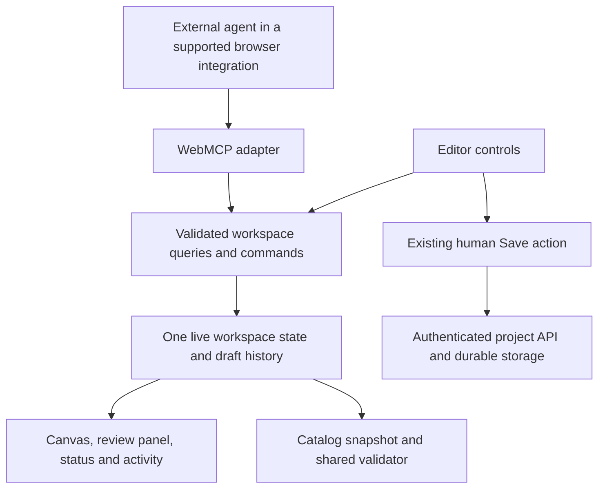

# Agent-assisted workspace

Status: complete through A7. The full inspect → co-edit → review → human Save workflow passed in real browsers and the fallback editor remains usable without WebMCP. Updated 12 September 2026.

## Outcome

With an existing Catalog Forge project open, a merchant and an external agent can inspect the catalog, understand feed issues, improve the overlay, and review representative products together. The browser shows every draft change immediately. The merchant can undo an agent edit and use the existing Save action when ready.

Example: “Check this catalog for problems, make the title easier to read, use a dark green price badge, and show me the longest title and a sale product in square and Story sizes.”

Success means completing this workflow through named application tools, without copying template JSON, scraping product tables, or simulating clicks for each layer edit. Screenshots remain useful for visual judgment; structured results alone cannot establish that a design looks good.

The first release starts after import, at `/editor?projectId=…`. Product data remains the saved source snapshot. Import automation, upstream product edits, and agent-driven publication are follow-ups.

## Architecture decision

Use a browser-side WebMCP adapter over shared application commands. The external agent supplies reasoning; Catalog Forge supplies context, deterministic actions, and visible feedback. No embedded chat service or model API is required for this slice.



WebMCP registration is not itself a remote MCP endpoint. A conventional MCP client needs a browser integration that can discover and invoke page tools. Prove the exact Codex/browser combination first; do not assume that Chrome support, an inspector demo, or an MCP server connection establishes Codex support.

The current WebMCP draft uses `document.modelContext`; older implementations use `navigator.modelContext`. Registration and cleanup behavior have also evolved. Isolate feature detection, registration, return serialization, cancellation, and cleanup in one adapter. Pin the supported runtime/API during the compatibility spike. Avoid exposing compatibility details to ordinary editor users. The spec remains a draft. [WebMCP specification](https://webmachinelearning.github.io/webmcp/), [Chrome implementation guidance](https://github.com/GoogleChrome/modern-web-guidance/blob/main/skills/modern-web-guidance/guides/webmcp/agentic-javascript-tools.md).

### Browser compatibility spike: release gate

Timebox to approximately one engineering day. Register a temporary context query and reversible draft action in an authenticated development project. Discover and invoke them from the intended Codex/browser surface, then verify the visible result. Record client/browser versions, required flags or integration, registration API, cleanup method, result format, and supported annotations. Exercise reload, navigation away, two open projects, and unsupported-browser behavior.

Start with the user's in-app browser as the preferred target, subject to this test. If the target cannot call the tools, evaluate an existing browser bridge as a separately estimated fallback; do not build a custom extension or relay inside the first slice. An inspector-only success does not meet the acceptance gate. Conventional MCP transport documentation is useful for a future bridge, but does not by itself prove page-tool access. [OpenAI MCP documentation](https://learn.chatgpt.com/docs/extend/mcp).

### Application boundary

- Extract the relevant editor state transitions into a workspace controller/reducer. Both UI controls and tools call it; handlers do not click DOM elements or maintain a second draft.
- Queries read current state at execution time. Avoid registration closures that retain an old project or template.
- The workspace boundary owns the loaded project, master and per-placement draft identities, active target, selected product/layer, draft revision, saved project/template/placement revisions, review state, and bounded undo history. Keep the initial read model small; extract mutation logic only when UI and tools both need the same command.
- Register tools only for the eligible editor session. Recheck session/project availability on execution; remove registration on logout, project teardown, and unmount. No global cross-tab dispatcher.
- Use the existing same-origin authenticated project read. Do not send session cookies or passwords as tool arguments or results. Scope v1 to the current single-admin authentication model; this does not introduce customer tenancy.
- Implement runtime validation from the same schemas advertised to agents. TypeScript types and tool annotations do not enforce permissions or valid input.
- Keep business contracts transport-independent so a later remote MCP adapter can reuse appropriate operations. Live canvas and draft tools remain inherently session-bound.

Implementation locations:

| Location | Responsibility |
| --- | --- |
| `src/workspace/controller.ts` | Shared state transitions and revision guards introduced incrementally as mutation tools land |
| `src/workspace/contracts.ts` | Inputs, results, errors and supported edit fields |
| `src/agent/tools.ts` | Tool definitions and thin command/query handlers |
| `src/agent/webmcp.ts` | Runtime compatibility and registration lifecycle |
| `src/components/AgentWorkspaceProvider.tsx` | Attach tools to the eligible editor session |
| `src/components/AgentActivity.tsx` | Activity, draft changes and undo controls |

## Initial toolset

Eight tools, with stable `catalog_forge_` prefixes. No generic HTTP, JavaScript, CSS, filesystem, or arbitrary JSON-patch execution tool.

| Tool | Input and result | Effect |
| --- | --- | --- |
| `catalog_forge_get_context` | No arguments. Returns session ID, project summary/source type, product counts/completeness, draft and saved revisions, dirty/loading state, selection, and supported tools, bindings, style fields and size presets. | Read only; compact orientation. |
| `catalog_forge_query_products` | Session/project IDs; optional IDs, text query, issue code, sale status, title-length sort, cursor and limit. Returns matching normalized rows with stable source IDs, total match count and next cursor. | Read only; default 20, maximum 50 rows. No upstream refresh. |
| `catalog_forge_get_validation` | Session/project IDs; optional severity, issue code and cursor. Returns full-snapshot summary, grouped findings, affected source IDs and whether checks are incomplete/unverified. | Read only; reuse `validateCatalog`, never validate just the displayed rows. |
| `catalog_forge_get_design` | Session/project IDs. Returns active template/layers, binding support, dimensions, draft revision, saved revision and supported rendering limitations. | Read only; bounded structured design. |
| `catalog_forge_set_view` | Session/project IDs, expected view revision; optional product ID, layer ID, panel. Returns actual selection and new view revision after the UI updates. | Changes visible selection only; does not filter feed membership or resize the saved design. |
| `catalog_forge_apply_design_changes` | Session/project IDs, explicit master-or-placement target, expected draft revision, operation ID and up to 20 typed edits. Returns before/after diff, changed layer IDs, warnings, new draft revision and undo token. | Atomic draft update; one undo entry. |
| `catalog_forge_preview_design` | Session/project IDs, expected draft revision, explicit products and sizes capped at 12 total cells. Opens the existing all-sizes surface in review mode and returns its view ID, inspected revision and bounded per-preview metadata/warnings. | Transient browser previews; no save, export or publication. |
| `catalog_forge_undo_design_change` | Session/project IDs, expected draft revision and undo token. Restores the immediately preceding matching design transaction and returns a new revision. | Draft-only undo; reject if intervening edits would be overwritten. |

`apply_design_changes` initially supports setting template background, adding text/badge/shape layers, updating layer content/geometry/allowlisted style/visibility, and removing unlocked layers. Product images can be repositioned and resized using existing assets. New remote images, arbitrary HTML, scripts, CSS URLs and conditional layer logic are excluded. Keep source bindings such as `{{price}}` intact unless the requested operation explicitly changes the content. Reject unknown bindings, duplicate IDs, invalid dimensions, unsupported fields, or locked-layer changes before committing any part of a batch.

The preview tool extends the existing all-sizes surface rather than creating a competing review UI. It adapts copies through `adaptTemplateToSize` and displays them through `TemplateRenderer`. It must not change the active template to produce the review grid. Use screenshots from the agent's browser integration to judge layout. A returned preview ID or a DOM overflow check is not visual approval and is not a claim of server PNG parity.

### Common execution contract

Use an application result envelope, mapped by the adapter to the selected runtime's return format:

```json
{
  "ok": true,
  "schemaVersion": 1,
  "sessionId": "session-example",
  "projectId": "prj_example",
  "draftRevision": 12,
  "data": {},
  "warnings": []
}
```

Failures contain `ok: false` and `error: { code, message, retryable }`, plus current revision when appropriate. Defined errors: `NO_ACTIVE_PROJECT`, `PROJECT_LOADING`, `AUTH_REQUIRED`, `SESSION_CHANGED`, `INVALID_ARGUMENT`, `PRODUCT_NOT_FOUND`, `LAYER_NOT_FOUND`, `REVISION_CONFLICT`, `UNSUPPORTED_OPERATION`, `UNDO_CONFLICT`, `CANCELLED`, and `INTERNAL_ERROR`. Invalid references never silently select the first product or template.

Every draft change by either actor increments one session-wide draft revision. Selection changes increment a separate view revision. A design mutation also names `targetId` as `master` or `placement:<sizeId>` so a view switch cannot redirect an in-flight command to another design. Preview generation checks its captured draft revision before display and reports a conflict if it became stale. Mutations are serialized by the controller. Repeated operation IDs with identical arguments return the original receipt without duplicating edits; reuse with different arguments is rejected. Keep a bounded per-session receipt cache and reject expired-session requests.

Draft revisions are distinct from persisted project/template revisions. After a human save, update the saved revision without marking newer in-flight edits as saved. After timeout/cancellation, agents query context and reconcile the operation receipt before retrying: cancellation is not a guarantee that an already committed action was rolled back.

Return only requested fields and bounded content; do not return entire HTML, arbitrary browser storage, credentials, or capability feed URLs in general context. Product titles/descriptions are untrusted data, never tool instructions. Tool descriptions are static application-authored strings. Read-only annotations describe queries accurately; selection and preview tools are not read-only because they change the visible workspace.

## Human and agent collaboration

Ordinary authorized draft edits execute immediately and visibly without a confirmation dialog for each layer. Each agent transaction records a short local activity entry, highlights changed layers, marks the design unsaved, and provides Undo. The human continues editing through the same controller. Undo history and operation receipts are session-scoped, not a durable audit system. Keep mutation tools unavailable outside development until A5 supplies activity, pause, and undo controls; read-only tools may ship earlier.

Show tool availability and recent actions, not an invented “agent connected” status: registration alone cannot establish that an agent is attached. Add a session control to pause agent edits. Reads can remain available while edits are paused; execution checks the control before any mutation.

V1 uses the existing human Save button. Do not expose save/publish aliases or claim that a generated feed is live in Meta. A user may still explicitly instruct their agent to operate the normal UI; this scope boundary defines the provided toolset, not a browser security boundary.

## Repository findings and dependencies

- `src/app/editor/page.tsx` currently owns draft, selection, layer operations, size adaptation and save handling. Extract only the transitions needed by these tools; avoid a whole-app rewrite.
- `src/lib/catalogProject.ts` and the project API already provide the normalized snapshot and stable project identity. V1 requires a loaded project, not the legacy domain-only editor.
- `src/lib/catalogValidation.ts` provides shared full-catalog validation. Findings must distinguish a source-data fix from an overlay edit; v1 cannot repair Shopify or imported rows.
- `src/editor/types.ts` provides bindings and layer types, but its descriptive JSON schema is not sufficient runtime validation. Introduce an explicit allowlist for tool edits.
- Browser/server render parity, durable placement snapshots, and publication are complete. A6 should reuse their current placement lineage helpers while still labeling its unsaved review output as a browser draft.
- Project PATCH now writes the authoritative project aggregate before its compatibility mirror, and publication isolates the live feed from draft saves. Its revision check is still a read followed by an unconditional write, so true cross-session compare-and-set remains future work. Keep agent save and publication tools out of this slice.
- The existing AI Assist keyword actions and JSON import mutate editor state directly. Route them through the same draft command boundary as manual controls when that boundary is introduced; do not maintain a second revision path just for legacy UI.
- Current authentication is shared-admin, not per-customer authorization. A multi-customer or remotely accessible MCP service requires its own access model and project ownership checks.

## Story-map slice and implementation sequence

The **Agent-assisted workspace** row follows Reliable Catalog. A1–A7 are done.

| Order / card ID | Journey step | Story and acceptance | Effort |
| --- | --- | --- | --- |
| A1 / `c-agent-browser-spike` | Connect | Use tools from the intended Codex/browser session. Record one successful context query and reversible visible action, exact setup, lifecycle behavior, and unsupported-browser fallback. | S, timeboxed |
| A2 / `c-agent-workspace-context` | Connect | Establish the live workspace read model, registration adapter and context tool, then migrate the minimum shared transitions needed by later commands. UI and tools see the same active project and current state; auth/project teardown removes tools; two tabs stay isolated. | L |
| A3 / `c-agent-catalog-inspection` | Validate | Query products and explain full-snapshot validation with stable IDs, pagination and explicit unverified checks. Include a failing row beyond row 50; do not change source data. | M |
| A4 / `c-agent-design-commands` | Design | Read design, select a view, and apply typed atomic draft changes. Enforce revision and schema checks; reject an invalid batch without partial edits; retry does not add duplicate layers. | L |
| A5 / `c-agent-visible-undo` | Design | Show agent changes, offer safe undo and pause edits. Human edits invalidate stale agent operations and unsafe undo; saved state stays accurate. | M |
| A6 / `c-agent-preview-review` | Size Variants | Extend the existing all-sizes view to review at most 12 product/placement cells from draft copies. Long-title, sale and missing-image examples remain identifiable; no template is saved or overwritten. | M |
| A7 / `c-agent-workflow-proof` | Test & Learn | Complete the example with an actual external agent; exercise refresh/authentication loss, two tabs, invalid IDs, retries, cancellation and human interleaving. Existing manual workflow still works without WebMCP. | M |

Delivery checkpoints: A1 establishes feasibility; A2+A3 deliver inspection; A4 is implemented behind a development gate and A5 enables safe co-editing; A6+A7 finish the reviewable workflow. A3 and A4 can proceed independently after A2 publishes the shared contracts. A custom bridge or persistence redesign is additional scope.

### Release evidence

1. Contract/controller tests cover atomic validation, stale revisions, duplicate operation receipts, safe undo and changed-session rejection.
2. Adapter tests cover the selected runtime, unavailable runtime, mount/unmount, current-state reads and teardown. Use targeted lifecycle tests rather than pretending mocks prove browser support.
3. A real Codex/browser run completes inspect → explain → edit → preview → human tweak → conflict recovery → undo → human save. Record screenshots and tool results, with private source text omitted from shared logs.
4. After the human save, reload and confirm the intended draft persisted. No tool invocation publishes to Meta, changes source products or generates server placement variants.
5. Run the existing regression suite, typecheck and build for the implementation. A browser without WebMCP retains the normal editor.

## Follow-ups

- Agent import/refresh via existing supported sources, with explicit replacement and dirty-draft semantics. Shopify Catalog/Admin integration remains deferred.
- `prepare_save` / `commit_save` once persistence and publication boundaries are reliable; bind any review to the exact revision and distinguish saving from updating live output.
- Agent-controlled placement saves and export inspection remain follow-ups; the first slice reviews browser drafts and keeps the existing human Save flow.
- Source overrides, conditional badges and brand assets as separate product capabilities shared by UI and tools.
- Remote MCP for background/bulk work only when needed, with tenant authorization, jobs, durable idempotency and audit history. Reuse contracts without trying to remotely reproduce live browser state.

Implementation and real-browser proof now cover A1–A7. The first Agent-assisted workspace slice is complete; no custom bridge, remote MCP service, agent save or agent publication path was added.
